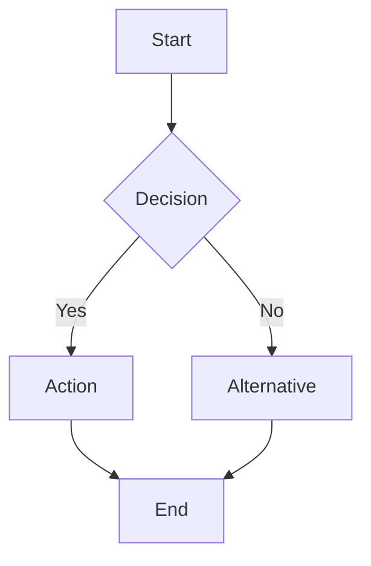
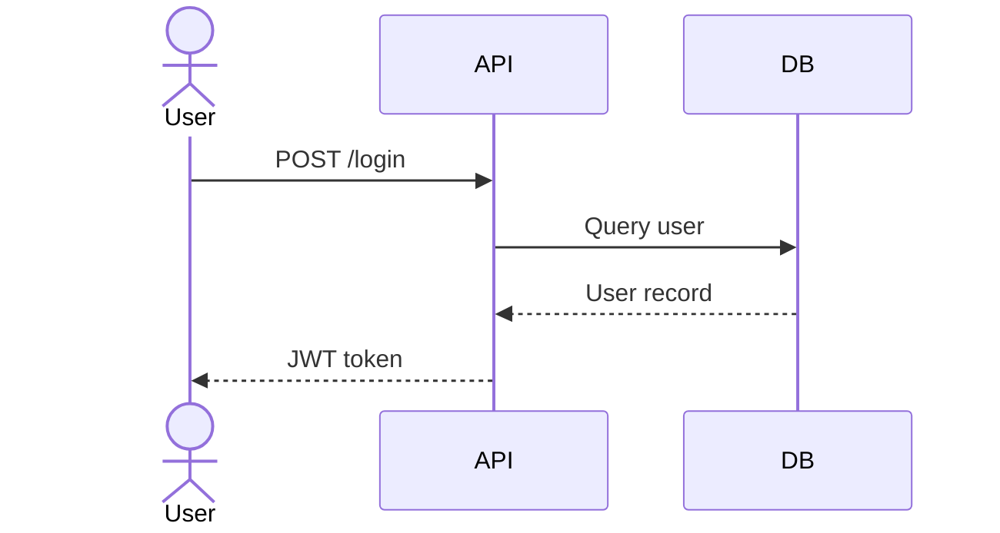
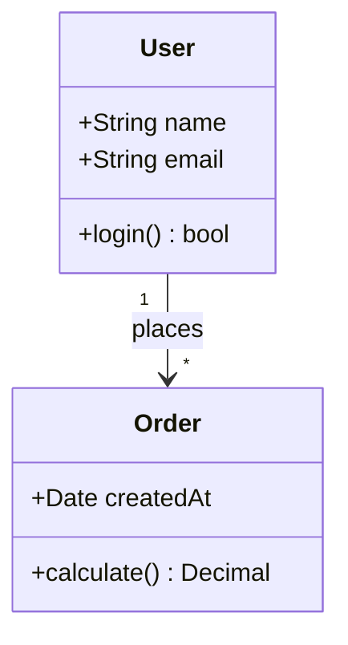
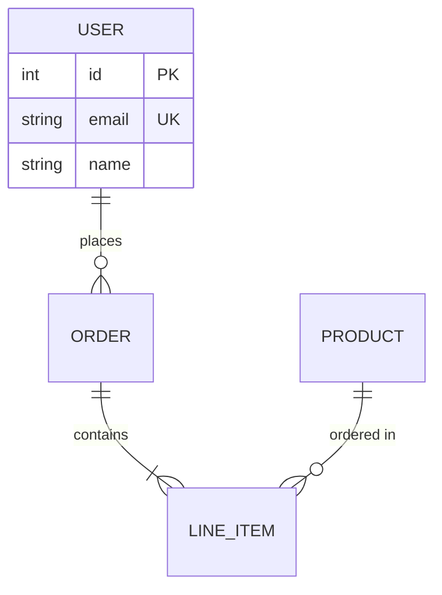
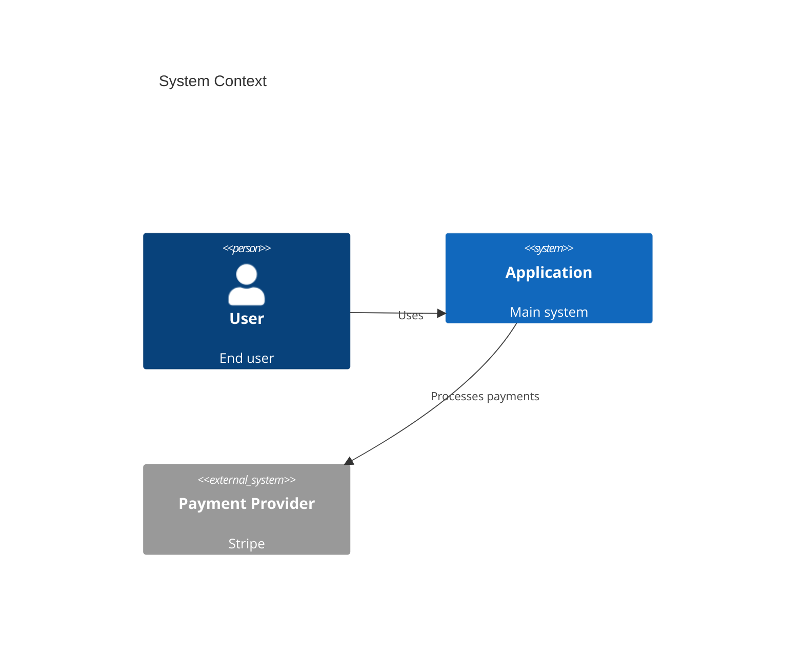
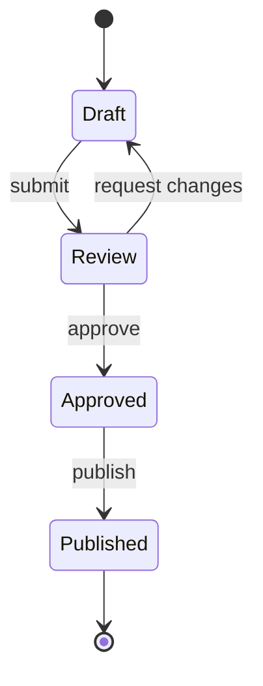
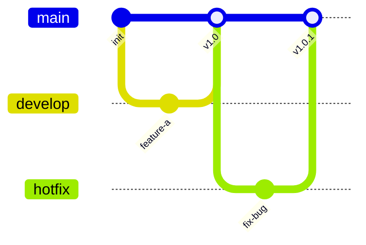
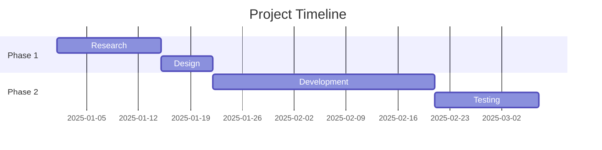

# /create-diagram

Generate clear, well-structured Mermaid diagrams for documentation, architecture decisions, or codebase visualization.

## Usage

```
/create-diagram [type] [topic]
```

**Arguments:**
- `type` — Diagram type: `flowchart`, `sequence`, `class`, `erd`, `architecture`, `state`, `git`, `gantt`
- `topic` — What to diagram (a description, a file path, or a system name)

## Examples

```
/create-diagram flowchart "User registration flow"
/create-diagram sequence "API authentication handshake"
/create-diagram class src/models/
/create-diagram erd "E-commerce database schema"
/create-diagram architecture "Payment processing system"
/create-diagram state "Order lifecycle"
/create-diagram gantt "Q3 roadmap milestones"
/create-diagram git "Release branching strategy"
```

## When to Use

- Documenting a system architecture or API flow
- Visualizing a database schema or domain model
- Explaining a process or algorithm in a pull request
- Adding diagrams to a README or technical doc
- Communicating a design decision to the team
- Planning a project timeline or release schedule
- Any time a picture is worth a thousand words of prose

## What It Does

1. **Understands** the subject — reads code, docs, or description to gather context
2. **Selects** the right diagram type if not specified
3. **Generates** clean Mermaid syntax following readability best practices
4. **Validates** the diagram renders correctly
5. **Outputs** a markdown code block ready for embedding

## Implementation Steps

Use `TodoWrite` to track progress through each phase.

### Phase 1: Understand the Subject

Gather context based on the input:

| Input Type | Action |
|-----------|--------|
| **Description** (e.g., "User registration flow") | Ask clarifying questions if the scope is ambiguous |
| **File path** (e.g., `src/models/`) | Read the files and extract structure, relationships, and flow |
| **System name** (e.g., "Payment processing") | Search the codebase for relevant files, then analyze |

For code-based diagrams, use `Glob` and `Grep` to find relevant files, then `Read` to extract:
- Class/interface definitions and their relationships
- Function call chains and data flow
- Database models and foreign keys
- State transitions and event handlers

### Phase 2: Select Diagram Type

If `type` is not specified, choose based on the subject:

| Subject | Best Diagram Type | Reasoning |
|---------|------------------|-----------|
| Process, workflow, algorithm, decision tree | **Flowchart** | Shows steps, branches, and decision points |
| API call, request/response, multi-service interaction | **Sequence** | Shows ordered interactions between actors |
| Domain model, class hierarchy, OOP design | **Class** | Shows types, properties, methods, and relationships |
| Database tables, schema, data relationships | **ERD** | Shows entities, attributes, and cardinality |
| System components, services, infrastructure | **Architecture** (C4) | Shows containers, components, and their connections |
| Lifecycle, mode transitions, state machine | **State** | Shows states, transitions, and events |
| Branching strategy, release process | **Git** | Shows branches, commits, merges |
| Timeline, milestones, task dependencies | **Gantt** | Shows tasks, durations, and dependencies |

If the subject could fit multiple types, prefer the one that communicates the most important dimension (e.g., if order matters → sequence; if relationships matter → class/ERD).

### Phase 3: Generate Mermaid Syntax

Follow these syntax patterns per diagram type:

**Flowchart:**


**Sequence:**


**Class:**


**ERD:**


**Architecture (C4):**


**State:**


**Git:**


**Gantt:**


### Phase 4: Apply Readability Rules

Every diagram must follow these rules:

| Rule | Guideline |
|------|-----------|
| **Max 15 nodes** | If more are needed, split into multiple diagrams or use subgraphs |
| **Clear labels** | Every node and edge should have a human-readable label |
| **Logical grouping** | Use subgraphs or sections to group related elements |
| **Consistent direction** | Use TD (top-down) for hierarchies, LR (left-right) for flows |
| **Meaningful edge labels** | Label relationships with verbs or short descriptions |
| **No crossing lines** | Arrange nodes to minimize edge crossings |
| **Color sparingly** | Use color only to highlight important paths or distinguish categories |
| **Descriptive title** | Add a title comment or `title` directive |

### Phase 5: Validate and Output

- Review the generated Mermaid syntax for correctness.
- Check that all node IDs are unique and all references resolve.
- Ensure the diagram answers the original question or documents the intended subject.
- Output as a fenced code block with `mermaid` language tag.

## NEVER Do

| Rule | Reason |
|------|--------|
| **NEVER create diagrams with 20+ nodes** | Large diagrams are unreadable. Split them into focused sub-diagrams. |
| **NEVER use cryptic node IDs as labels** | `A --> B` is meaningless. Always add labels: `A[User] --> B[Dashboard]` |
| **NEVER mix multiple concerns in one diagram** | Each diagram should answer one question. Don't combine data flow with deployment topology. |
| **NEVER omit edge labels on ambiguous relationships** | If the relationship isn't obvious from context, label it |
| **NEVER use diagrams where a list would suffice** | Not everything needs a diagram. Use them when spatial relationships matter. |
| **NEVER generate invalid Mermaid syntax** | Test that all brackets, quotes, and arrows are properly matched |

## Output

A Mermaid code block ready for markdown embedding:

````
```mermaid
[diagram type and content]
```
````

If the subject requires multiple diagrams (e.g., a system with both architecture and sequence flows), output each as a separate labeled code block with a brief description of what it shows.

## Related

- **Skill:** [`mermaid-diagrams`](ai/skills/writing/mermaid-diagrams/SKILL.md) — comprehensive Mermaid reference with advanced features
- **Agent:** [`development`](ai/agents/development/AGENT.md) — development agent
- **Command:** `/write-content` — embed diagrams in documentation or blog posts
- **Command:** `/new-adr` — add diagrams to architecture decision records
